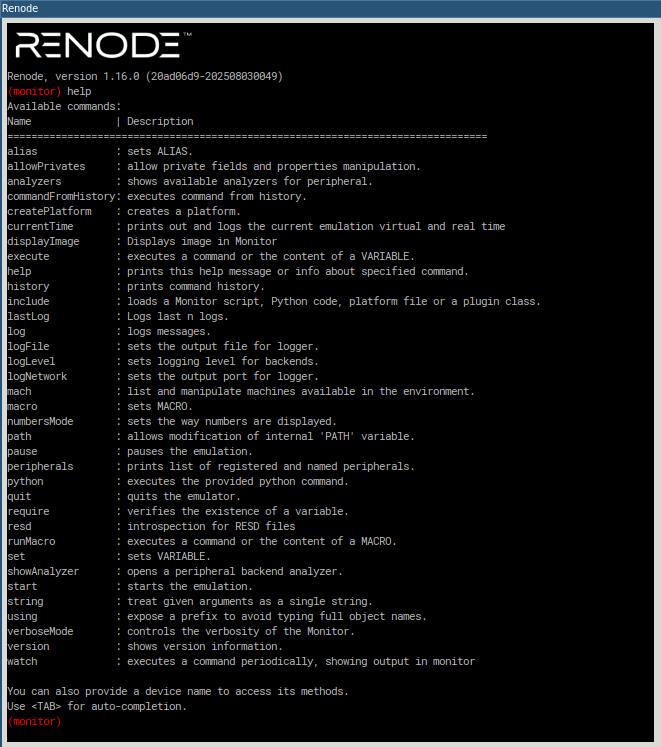

## Intro
Renode is designed to be a system emulator that can be used in CI/CD scenarios on multiple devices.
It supports a variety of network protocols.
- It has built-in emulation for commonly used processor architectures such as ARM, RISC-V, PowerPC, and x86.
- Renode can use the same firmware as that used in production and run it against emulated cores, peripherals, and even sensors and actuators.
- Because of its extensive networking support and multisystem emulation capabilities, it is well suited for testing systems made up of multiple communicating devices.
- It makes it possible to start development before the hardware is ready, to test the firmware on multiple target architectures.
## Using Renode
- `help` command show all the commands.
- `help <command>` shows help for a specific command.

- The monitor CLI has command history, autocompletion using tab, interactive search (ctrl-r), and copying and pasting similar to the normal bash.
### Renode Scripts
Renode has a scripting language, the simplest script is the one line renode command.
Scripts can be constructed by combining commands, in turn scripts can include both commands and other scripts.
- Renode commands can be used to interact with the external interfaces (peripherals) of the emulated machines such as UARTs or Ethernet controllers.
- When running Renode interactively, the user would normally start with creating the emulation through a sequence of commands building up, configuring, and connecting the relevant emulated (guest) platform or platforms (called “machines”).
- This is normally done using nested `.resc` scripts, which help encapsulate some of the repeatable elements in this activity.
- A script can be loaded with the include command, for example: `include @/path/to/script.resc`
### Example: Simulation of `stm32f407 discovery` Board

1. Creating the machine
```bash
mach create
```
- if no name is give, the name `machine-0` is given by default.
2. Load platform description for a specific device.
- We can either load the CPU's `.repl` platform script:
```bash
machine LoadPlatformDescription @platforms/cpus/stm32f4.repl
```
- Or we can load the board's `.repl`:
```bash
machine LoadPlatformDescription @platforms/boards/stm32f4_discovery.repl
```
3. Load the binary used
```bash
sysbus LoadELF @/path/to/build/elf
```
4. Display the uart where the messages are shown.
```bash
showAnalyzer sysbus.usart2
```
- Opens a usart console that show the output of `usart2` peripheral which zephyr uses for output.
5. Start the simulation
```bash
start
```
![[Pasted image 20250901110920.png]]
---
[Installing Renode - Renode - documentation](https://renode.readthedocs.io/en/latest/introduction/installing.html)
[Renode - documentation](https://renode.readthedocs.io/en/latest/index.html)
[Zephyr RTOS Embedded C Programming - Andrew Eliasz](https://link.springer.com/content/pdf/10.1007/979-8-8688-0107-5.pdf)