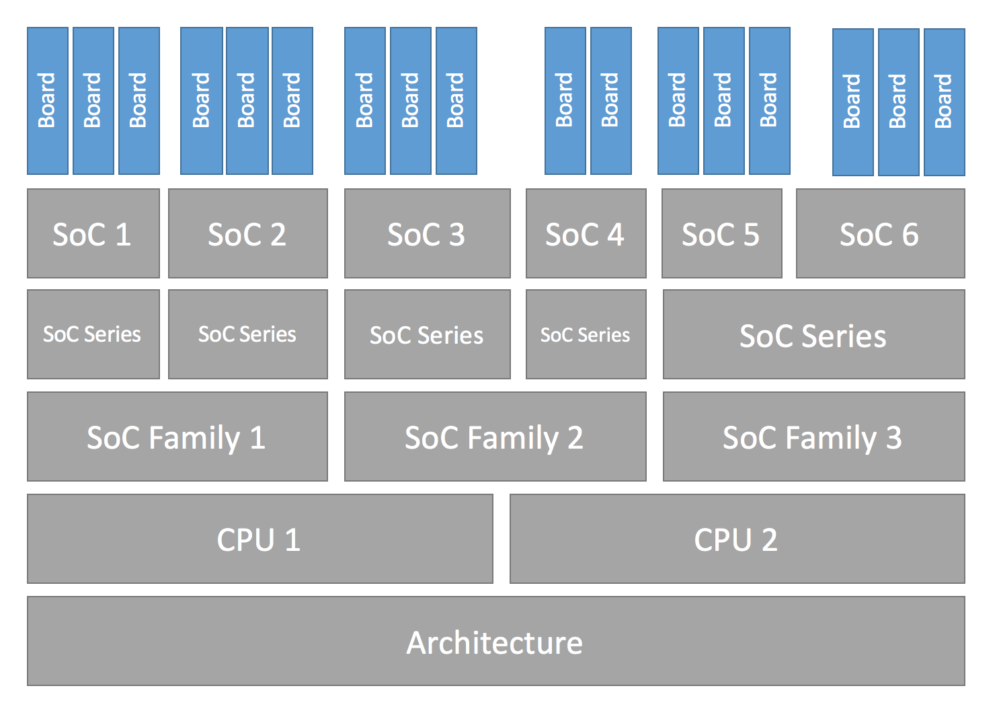
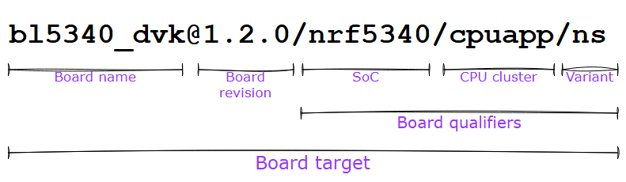

## Hardware Support Hierarchy
> Zephyr’s hardware support is based on a series of hierarchical abstractions. Primarily, each [board](https://docs.zephyrproject.org/latest/glossary.html#term-board) has one or more [SoC](https://docs.zephyrproject.org/latest/glossary.html#term-SoC). Each SoC can be optionally classed into an [SoC series](https://docs.zephyrproject.org/latest/glossary.html#term-SoC-series), which in turn may optionally belong to an [SoC family](https://docs.zephyrproject.org/latest/glossary.html#term-SoC-family). Each SoC has one or more [CPU cluster](https://docs.zephyrproject.org/latest/glossary.html#term-CPU-cluster), each containing one or more [CPU core](https://docs.zephyrproject.org/latest/glossary.html#term-CPU-core) of a particular [architecture](https://docs.zephyrproject.org/latest/glossary.html#term-architecture).


## Board Terminology
The board is described using the board name + revision and qualifiers. If a board contains a single core SoC, we can use the board's name only, we don't need qualifiers.
- Formally this can also be seen as `board name[@revision][/board qualifiers]`, which can be extended to `board name[@revision][/SoC[/CPU cluster][/variant]]`.
*Example:*

## Adding Board Support
You should first check if the SoC on your board is supported from [Supported Boards and Shields — Zephyr Project Documentation](https://docs.zephyrproject.org/latest/boards/index.html#boards=).
- If not supported, see [Architecture Porting Guide — Zephyr Project Documentation](https://docs.zephyrproject.org/latest/hardware/porting/arch.html#architecture-porting-guide).
- If the SoC is supported, check for other boards that use the same SoC and copy the common files and edit it based on the hardware of your board.
### Creating Your Board Directory
First your board name must be unique. Run `west boards` for a list of the board names already taken.
- You can either create your board in the zephyr repo:  `zephyr/boards/<VENDOR>/<board>`
- Or you can create out-of-tree board but specify `board_ROOT` variable. The `BOARD_ROOT` should be the parent of the `boards` directory.
	- *Example*: if the board files are in `home/boards/<VENDOR>/<boardS>`, the `BOARD_ROOT` directory should be `BOARD_ROOT=home/`
**Board Directory Hierarchy**	
```
boards/<VENDOR>/<board>
├── board.yml
├── board.cmake
├── CMakeLists.txt
├── doc
│   ├── <board>.webp
│   └── index.rst
├── Kconfig.<board>
├── Kconfig.defconfig
├── <board>_<qualifiers>_defconfig
├── <board>_<qualifiers>.dts
└── <board>_<qualifiers>.yaml
```
---
**Mandatory Files**
1. `board.yml`: a YAML file that describes the metadata of the boards such as board names, their SoCs, and variants.
	-  CPU clusters for multi-core SoCs are not described in this file as they are inherited from the SoC’s YAML description.
*Example*: `board.yml`
```YAML
board:
  name: newboard
  vendor: custom
  socs:
    - name: stm32f407xx
```

2. `<board>_<qualifiers>.dts`: hardware description in devicetree format. This declared the board and SoC hardware components, such as communication peripherals, LEDs, buttons, etc.
3. `Kconfig.<board>`: the base software configuration for selecting SoC and other board and SoC related settings.
	-  To select general Zephyr Kconfig settings the `Kconfig` file must be used.

---
**Optional Files**
- `Kconfig`, `Kconfig.defconfig`: software configuration `Kconfig` format. This provides the default setting for software features and drivers.
	*Example*: `Kconfig.defconfig`
```
if board_NEWBOARD

config board
    default "newboard"

endif # board_NEWBOARD
```
- `<board>_defconfig` and `<BOARD>_<qualifiers>_defconfig`: default software configuration in `Kconfig` `.conf` format.
	*Example*: `newboard_defconfig`
```conf
CONFIG_ARM_MPU=y
CONFIG_HW_STACK_PROTECTION=y
CONFIG_SERIAL=y
CONFIG_CONSOLE=y
CONFIG_UART_CONSOLE=y
CONFIG_GPIO=y
```
- `board.cmake`: flash and debug support for the board
	*Example*: `board.cmake`
```cmake
board_runner_args(openocd "--config" "board/stm32f4discovery.cfg")
include(${ZEPHYR_BASE}/boards/common/openocd.board.cmake)
```
- `CMakeLists.txt`: if you need to add additional source files to your build.
- `doc/index.rst`, `doc/<board>.webp`: documentation for and a picture of your board. You only need this if you’re Contributing your board to Zephyr.
- `<board>_<qualifiers>.yaml`: a YAML file with metadata used by the [Test Runner (Twister)](https://docs.zephyrproject.org/latest/develop/test/twister.html#twister-script)
### Writing your board YAML
The board YAML file describes the board at a high level. This includes the SoC, board variants and board revisions.
```YAML
board:
  name: <board-name>
  vendor: <board-vendor>
  revision:
    format: <major.minor.patch|letter|number|custom>
    default: <default-revision-value>
    exact: <true|false>
    revisions:
    - name: <revA>
    - name: <revB>
      ...
  socs:
  - name: <soc-1>
    variants:
    - name: <variant-1>
    - name: <variant-2>
      variants:
      - name: <sub-variant-2-1>
        ...
  - name: <soc-2>
    ...
```
It is possible to have multiple boards located in the board folder. If multiple boards are placed in the same board folder, then the file `board.yml` must describe those in a list as:
```YAML
boards:
- name: <board-name-1>
  vendor: <board-vendor>
  ...
- name: <board-name-2>
  vendor: <board-vendor>
  ...
...
```
### Writing The Board's Devicetree
`<board>.dts` generally will look this:
```C
/dts-v1/;
#include <your_soc_vendor/your_soc.dtsi>

/ {
        model = "A human readable name";
        compatible = "yourcompany,<board>";

        chosen {
                zephyr,console = &your_uart_console;
                zephyr,sram = &your_memory_node;
                /* other chosen settings  for your hardware */
        };

        /*
         * Your board-specific hardware: buttons, LEDs, sensors, etc.
         */

        leds {
                compatible = "gpio-leds";
                led0: led_0 {
                        gpios = < /* GPIO your LED is hooked up to */ >;
                        label = "LED 0";
                };
                /* ... other LEDs ... */
        };

        buttons {
                compatible = "gpio-keys";
                /* ... your button definitions ... */
        };

        /* These aliases are provided for compatibility with samples */
        aliases {
                led0 = &led0; /* now you support the blinky sample! */
                /* other aliases go here */
        };
};

&some_peripheral_you_want_to_enable { /* like a GPIO or SPI controller */
        status = "okay";
};

&another_peripheral_you_want {
        status = "okay";
};
```
Only one `.dts` file will be used, if you have multiple `.dts` files, the file will be chosen based on what qualifiers are specified in the build, but the default one will be `<board>.dts`.
### Writing the Kconfig Files
There is one mandatory `kconfig` file which is the `Kconfig.<board>` file, other files are optional.
```
boards/<vendor>/<board>
├── Kconfig
├── Kconfig.<board>
├── Kconfig.defconfig
├── <board>_defconfig
└── <board>_<qualifiers>_defconfig
```

**`Kconfig.<board>`**
A shared Kconfig file which can be sourced both in Zephyr Kconfig and sysbuild Kconfig trees.
This file selects the SoC in the Kconfig tree and potential other SoC related Kconfig settings. This file must not select anything outside the re-usable Kconfig board and SoC trees.
*Example*: `Kconfig.newboard` should look like
```Kconfig
config BOARD_NEWBOARD
    select SOC_SOC1
```

**`Kconfig`**
Included by [boards/Kconfig](https://github.com/zephyrproject-rtos/zephyr/blob/main/boards/Kconfig).
This file can add Kconfig settings which are specific to the current board.
A board specific setting should be defining a custom setting and usually with a prompt, like this:
```Kconfig
config BOARD_FEATURE
    bool "Board specific feature"
```
If the setting name is identical to an existing Kconfig setting in Zephyr and only modifies the default value of said setting, then `Kconfig.defconfig` should be used instead.

**`Kconfig.defconfig`**
Board specific default values for Kconfig options.
The entire file should be inside an `if BOARD_PLANK` / `endif` pair of lines, like this:
```Kconfig
if BOARD_PLANK

config FOO
        default y

if NETWORKING
config SOC_ETHERNET_DRIVER
        default y
endif # NETWORKING

endif # BOARD_PLANK
```

**`<board>_defconfig`**/ **`<board>_<qualifiers>_defconfig`**
A `Kconfig` fragment that gets merged in whenever an application is compiled for your board.
If both the common `plank_defconfig` file and one or more board qualifiers specific `plank_<qualifiers>_defconfig` files exist, then all matching files will be used. This allows you to place configuration which is common for all board SoCs, CPU clusters, and board variants in the base `plank_defconfig` and only place the adjustments specific for a given SoC or board variant in the `plank_<qualifiers>_defconfig`.

The `_defconfig` should contain mandatory settings for your UART, console, etc. The results are architecture-specific, but typically look something like this:
```conf
CONFIG_GPIO=y
CONFIG_CONSOLE=y
CONFIG_UART_CONSOLE=y
CONFIG_SERIAL=y
```
## Flash and Debug Support
`board.cmake` file is necessary to add `flash` and `debug` support to west as extension commands.
`board.cmake` looks something like this:
```cmake
board_runner_args(jlink "--device=nrf52" "--speed=4000")
board_runner_args(pyocd "--target=nrf52" "--frequency=4000000")

include(${ZEPHYR_BASE}/boards/common/nrfutil.board.cmake)
include(${ZEPHYR_BASE}/boards/common/nrfjprog.board.cmake)
include(${ZEPHYR_BASE}/boards/common/jlink.board.cmake)
include(${ZEPHYR_BASE}/boards/common/pyocd.board.cmake)
```
This example configures the `nrfutil`, `nrfjprog`, `jlink`, and `pyocd` runners.

---
- [Board Porting Guide — Zephyr Project Documentation](https://docs.zephyrproject.org/latest/hardware/porting/board_porting.html)

#embedded #zephyr 